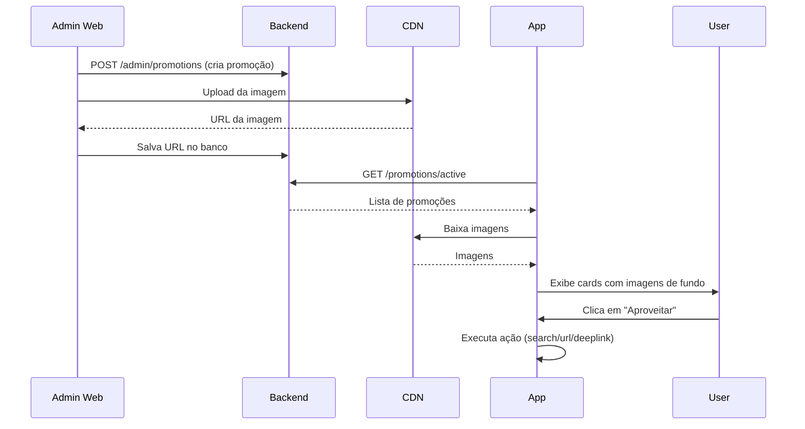

k# 🎨 Implementação de Promoções Dinâmicas

## Resumo

As promoções agora são **dinâmicas** e vêm do backend, permitindo que administradores criem/editem campanhas com **imagens de fundo personalizadas** sem precisar atualizar o app.

---

## 📋 Frontend (✅ IMPLEMENTADO)

### Estrutura criada:

```
src/domain/App/Promotion/
├── promotionTypes.ts       # Interfaces TypeScript
├── promotionAPI.ts         # Cliente API
├── useCases/
│   ├── usePromotions.ts    # Custom hook
│   └── index.ts
└── index.ts
```

### Features implementadas:

✅ Cards dinâmicos com **ImageBackground** (imagem de fundo)
✅ Suporte a múltiplas promoções
✅ Ações configuráveis (buscar viagens, abrir URL externa)
✅ Cor de texto ajustável (claro/escuro) para contraste
✅ Fallback de cor se imagem não carregar
✅ Filtragem automática por período (startDate/endDate)
✅ Ordenação por prioridade

---

## 🔧 Backend (⚠️ PENDENTE)

### Endpoint necessário:

```http
GET /promotions/active
Authorization: Bearer {token}

Response 200 OK:
{
  "promotions": [
    {
      "id": "promo-001",
      "title": "Ganhe 25% de desconto",
      "description": "Na sua primeira viagem com parceiros selecionados",
      "imageUrl": "https://your-cdn.com/images/promo-verao.jpg",
      "ctaText": "Aproveitar",
      "ctaAction": "search",
      "ctaValue": null,
      "backgroundColor": "rgba(0, 123, 255, 0.7)",
      "textColor": "light",
      "isActive": true,
      "priority": 10,
      "startDate": "2026-02-01T00:00:00Z",
      "endDate": "2026-03-31T23:59:59Z"
    },
    {
      "id": "promo-002",
      "title": "Festival de Parintins",
      "description": "Reserve já sua viagem para o maior festival folclórico da Amazônia",
      "imageUrl": "https://your-cdn.com/images/parintins-festival.jpg",
      "ctaText": "Saiba Mais",
      "ctaAction": "url",
      "ctaValue": "https://www.festivaldeparintins.com.br",
      "backgroundColor": "rgba(255, 0, 0, 0.6)",
      "textColor": "light",
      "isActive": true,
      "priority": 5,
      "startDate": "2026-05-01T00:00:00Z",
      "endDate": "2026-06-30T23:59:59Z"
    }
  ]
}
```

---

## 📊 Modelo de Dados Sugerido

### Schema SQL (PostgreSQL/MySQL):

```sql
CREATE TABLE promotions (
  id VARCHAR(36) PRIMARY KEY DEFAULT uuid_generate_v4(),
  title VARCHAR(100) NOT NULL,
  description TEXT NOT NULL,
  image_url TEXT NOT NULL,
  cta_text VARCHAR(50) NOT NULL DEFAULT 'Aproveitar',
  cta_action VARCHAR(20) NOT NULL CHECK (cta_action IN ('search', 'url', 'deeplink')),
  cta_value TEXT,
  background_color VARCHAR(30),
  text_color VARCHAR(10) NOT NULL CHECK (text_color IN ('light', 'dark')),
  is_active BOOLEAN NOT NULL DEFAULT true,
  priority INTEGER NOT NULL DEFAULT 0,
  start_date TIMESTAMP NOT NULL,
  end_date TIMESTAMP NOT NULL,
  target_audience JSONB, -- Segmentação opcional
  created_at TIMESTAMP DEFAULT CURRENT_TIMESTAMP,
  updated_at TIMESTAMP DEFAULT CURRENT_TIMESTAMP,
  created_by VARCHAR(36) REFERENCES users(id)
);

CREATE INDEX idx_promotions_active ON promotions(is_active, priority DESC);
CREATE INDEX idx_promotions_dates ON promotions(start_date, end_date);
```

---

## 🎯 Tipos de Ações (ctaAction)

| Valor | Descrição | Comportamento no App |
|-------|-----------|---------------------|
| `search` | Navegar para busca | Abre a tela de busca de viagens |
| `url` | Abrir URL externa | Abre link no navegador (ctaValue obrigatório) |
| `deeplink` | Deep link interno | Navega para rota específica do app |

---

## 🎨 Configuração de Cores

### textColor:
- `light` (branco/claro) → Use para fundos escuros
- `dark` (preto/escuro) → Use para fundos claros

### backgroundColor (opcional):
- Overlay semi-transparente sobre a imagem
- Formato: `"rgba(R, G, B, A)"` onde A = opacidade (0-1)
- Exemplo: `"rgba(0, 0, 0, 0.3)"` = preto 30% opaco
- Se não informado, usa `"rgba(0, 0, 0, 0.3)"` como padrão

---

## 📝 Exemplo de Payload para Criar Promoção

```json
{
  "title": "Verão Amazônico 🌴",
  "description": "Desconto de até 40% em viagens selecionadas para o verão",
  "imageUrl": "https://s3.amazonaws.com/navegaja/promos/verao-2026.jpg",
  "ctaText": "Ver Ofertas",
  "ctaAction": "search",
  "backgroundColor": "rgba(255, 140, 0, 0.5)",
  "textColor": "light",
  "priority": 10,
  "startDate": "2026-02-01T00:00:00Z",
  "endDate": "2026-03-31T23:59:59Z"
}
```

---

## 🖼️ Especificações de Imagem

### Requisitos:
- **Formato**: JPEG, PNG ou WebP
- **Resolução mínima**: 800x400px (proporção 2:1)
- **Resolução recomendada**: 1200x600px
- **Tamanho máximo**: 500 KB (otimizar para mobile)
- **CDN**: Use CloudFlare, AWS S3, ou Cloudinary

### Dicas de Design:
1. Deixe espaço vazio para o texto (canto inferior esquerdo)
2. Use imagens com bom contraste
3. Evite textos na imagem (use os campos title/description)
4. Teste em modo escuro E claro

---

## 🚀 Exemplo de Integração Backend (Node.js)

```typescript
import { Router } from 'express';
import { authMiddleware } from '../middleware/auth';

const router = Router();

router.get('/promotions/active', authMiddleware, async (req, res) => {
  const now = new Date();

  const promotions = await db.promotions.findAll({
    where: {
      isActive: true,
      startDate: { [Op.lte]: now },
      endDate: { [Op.gte]: now },
    },
    order: [['priority', 'DESC']],
  });

  res.json({ promotions });
});

// Admin endpoints
router.post('/admin/promotions', adminMiddleware, async (req, res) => {
  const promotion = await db.promotions.create({
    ...req.body,
    createdBy: req.user.id,
  });

  res.status(201).json(promotion);
});

router.put('/admin/promotions/:id', adminMiddleware, async (req, res) => {
  await db.promotions.update(req.body, {
    where: { id: req.params.id },
  });

  res.json({ success: true });
});

router.delete('/admin/promotions/:id', adminMiddleware, async (req, res) => {
  await db.promotions.destroy({
    where: { id: req.params.id },
  });

  res.json({ success: true });
});
```

---

## 🎭 Interface Web Admin (Sugestão)

### Campos do formulário:

```tsx
<Form>
  <Input label="Título" name="title" maxLength={100} required />
  <Textarea label="Descrição" name="description" required />
  <ImageUpload label="Imagem de Fundo" name="imageUrl" required />

  <Input label="Texto do Botão" name="ctaText" defaultValue="Aproveitar" />

  <Select label="Ação do Botão" name="ctaAction">
    <option value="search">Buscar Viagens</option>
    <option value="url">Abrir URL Externa</option>
  </Select>

  <Input
    label="URL Destino"
    name="ctaValue"
    placeholder="https://exemplo.com"
    showIf={ctaAction === 'url'}
  />

  <ColorPicker
    label="Cor de Overlay (opcional)"
    name="backgroundColor"
    format="rgba"
  />

  <Radio label="Cor do Texto" name="textColor">
    <option value="light">Claro (para fundos escuros)</option>
    <option value="dark">Escuro (para fundos claros)</option>
  </Radio>

  <Input type="number" label="Prioridade" name="priority" defaultValue={0} />

  <DatePicker label="Data Início" name="startDate" required />
  <DatePicker label="Data Fim" name="endDate" required />

  <Checkbox label="Ativa" name="isActive" defaultChecked />
</Form>
```

---

## 📱 Preview no App

Após criar uma promoção no admin, ela aparecerá na **HomeScreen** do app assim que:

1. ✅ `isActive = true`
2. ✅ Data atual entre `startDate` e `endDate`
3. ✅ Usuário puxar para atualizar (pull-to-refresh) ou reabrir o app

---

## 🔄 Fluxo Completo



---

## ✅ Checklist de Implementação

### Backend:
- [ ] Criar tabela `promotions`
- [ ] Implementar endpoint `GET /promotions/active`
- [ ] Implementar endpoints admin (CRUD)
- [ ] Configurar upload de imagens (S3/Cloudinary)
- [ ] Adicionar validações (datas, URLs, etc.)
- [ ] Testar com dados mock

### Admin Web:
- [ ] Criar página de gerenciamento de promoções
- [ ] Formulário de criação/edição
- [ ] Upload de imagens
- [ ] Preview da promoção
- [ ] Lista com filtros e busca
- [ ] Ativar/desativar promoções

### Testes:
- [ ] Criar promoção de teste
- [ ] Verificar exibição no app
- [ ] Testar ações (search, url)
- [ ] Testar múltiplas promoções
- [ ] Testar período de validade
- [ ] Testar com imagens grandes/pequenas

---

## 🎉 Resultado Final

Com esta implementação, você terá:

✅ Promoções 100% customizáveis
✅ Imagens de fundo de alta qualidade
✅ Controle total pelo painel admin
✅ Sem necessidade de atualizar o app
✅ Múltiplas campanhas simultâneas
✅ Segmentação por período

**Pronto para começar! 🚀**
